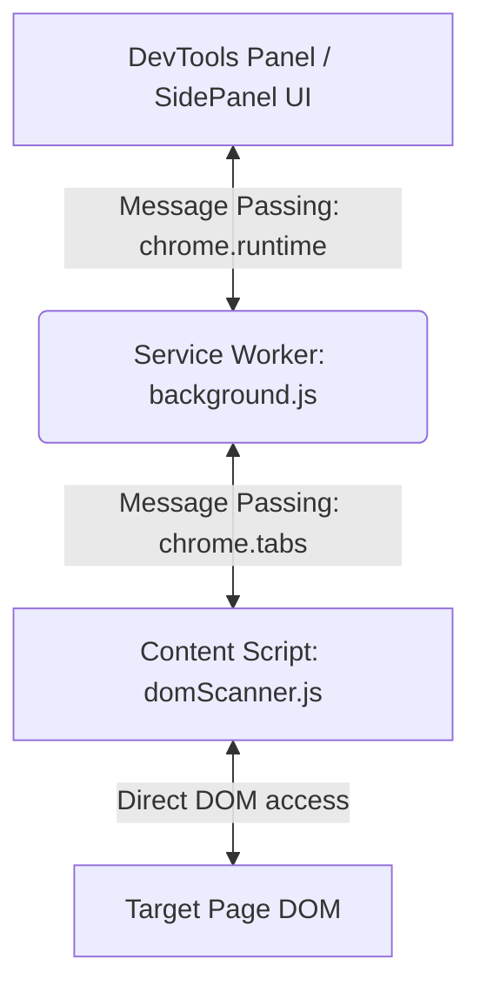

# Technical Requirements Document (TRD) - Locator-X Chrome Extension

## 1. System Architecture

Locator-X is built using the **Chrome Extension Manifest V3** standard. It consists of three decoupled execution environments that communicate via Chrome Message Passing APIs:



### 1.1. Service Worker (`background.js`)
*   **Role:** Acts as the network broker and state cache.
*   **Key Responsibilities:**
    *   Listens for tab updates (`chrome.tabs.onActivated`, `chrome.tabs.onRemoved`) and maintains isolated state per browser tab using `chrome.storage.session`.
    *   Tracks OAuth redirects and authentication status, routing profile configuration payload back to panels.
    *   Coordinates the right-click context menu registry (`chrome.contextMenus`), fetching generated locators for the selected node from the active content script.

### 1.2. Content Script (`domScanner.js` & `locator-generator.js`)
*   **Role:** Runs inside the context of the active web page.
*   **Key Responsibilities:**
    *   Listens for mouse move, click, and key events to highlight hovered elements (`lx-high` attribute).
    *   Traverses the page hierarchy (including open/closed Shadow DOMs and iframes).
    *   Computes and validates locators when elements are clicked or searched.

### 1.3. UI Panel (`panel-controller.js` & `panel.html`)
*   **Role:** Renders the user interface inside the extension SidePanel or DevTools tab.
*   **Key Responsibilities:**
    *   Manages user settings, Page Object Models, and custom pattern uploads.
    *   Performs evaluator broadcasts to check selector match counts across all active page frames.

---

## 2. Key Technical Specifications

### 2.1. Traversal of Shadow DOM & Iframe Boundaries
Standard DOM traversal APIs (like `querySelectorAll` or `document.evaluate`) fail when encountering Shadow DOM hosts or cross-origin iframes.
*   **Shadow DOM Crawling:** The locator generator utilizes recursive tree scans that inspect `el.shadowRoot`. For element matching, it uses a deep querySelector variant (`querySelectorDeep`) which traverses shadow boundaries recursively using `shadowRoot.querySelectorAll('*')`.
*   **Iframe Resolution:** If the selected element resides within an iframe, the content script:
    1.  Determines if the frame is same-origin or cross-origin.
    2.  Generates the relative XPath of the iframe node within the parent document using `window.frameElement`.
    3.  Transmits iframe relative paths alongside the inner selector to the evaluator, allowing the test executor to generate chained locators (e.g., `page.frameLocator("xpath").locator("selector")`).

### 2.2. Axes XPath Generation Algorithm
To establish a stable locator for a **Target** node based on an **Anchor** node:
1.  **Closest Common Ancestor (CCA) Resolution:**
    *   Traverse up the parent chain from the Anchor and Target until a shared ancestor element is identified:
        ```javascript
        let cca = anchor.parentNode;
        while (cca && !cca.contains(target)) {
            cca = cca.parentNode;
        }
        ```
2.  **Bitmask Position Identification:**
    *   Use `anchor.compareDocumentPosition(target)` to determine the document hierarchy:
        *   `Node.DOCUMENT_POSITION_CONTAINED_BY`: Axis is `descendant`.
        *   `Node.DOCUMENT_POSITION_CONTAINS`: Axis is `ancestor`.
        *   `Node.DOCUMENT_POSITION_FOLLOWING`: If parent nodes match, axis is `following-sibling`, else `following`.
        *   `Node.DOCUMENT_POSITION_PRECEDING`: If parent nodes match, axis is `preceding-sibling`, else `preceding`.
3.  **Predicate Optimization:**
    *   Evaluate the target tag, text content, or non-dynamic attributes to generate a specific predicate (e.g., `//div[@id='anchor']/following-sibling::button[text()='Submit']`).
4.  **Index Fallback:**
    *   Run `document.evaluate` on the resulting XPath. If multiple matching nodes are found, wrap the expression in parentheses and append the target's specific 1-indexed location: `(xpath)[index]`.

### 2.3. Asynchronous Local State Management
All local state (POM configuration, saved locators, settings, history, theme selection) is persisted asynchronously in `chrome.storage.local`. 
A migration schema is run on initialization to transfer legacy data from the synchronous `localStorage` sandbox to the extension's local storage.

---

## 3. Communication Protocol

### Message Mappings (Events Registry)

| Event Action | Sender | Receiver | Payload Schema | Expected Action |
| :--- | :--- | :--- | :--- | :--- |
| `startScanning` | UI Panel | Content Script | `{ mode: 'home' }` | Attaches mouse listeners and sets cursor to crosshair. |
| `locatorsGenerated` | Content Script | UI Panel | `{ locators: [], elementInfo: "", metadata: {} }` | Receives and renders the list of strategies in the UI table. |
| `evaluateSelector` | UI Panel/Evaluator | Content Script | `{ selector: "", type: "", maxMatchLimit: 150 }` | Validates selector matches on the page and returns match counts. |
| `saveTabState` | UI Panel | Service Worker | `{ tabId: 12, state: {} }` | Persists session details across tab updates. |
| `activeTabChanged` | Service Worker | UI Panel | `{ tabId: 12, state: {} }` | Restores the inspection view for the newly selected tab context. |
