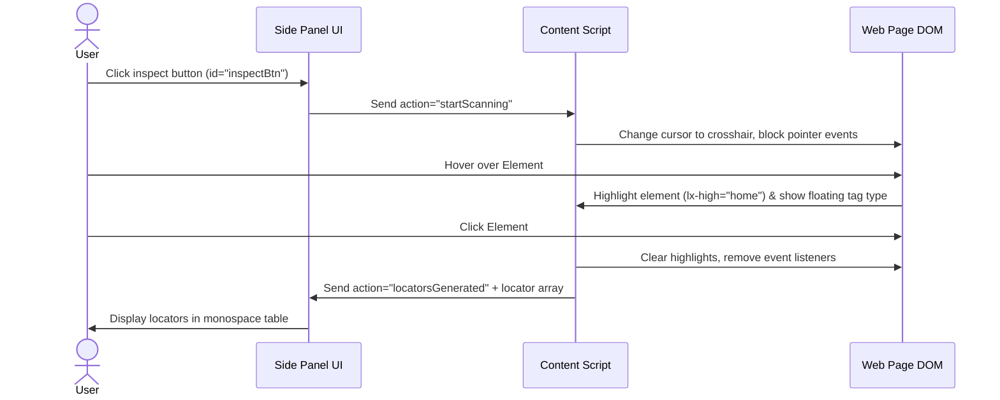

# App Flow / UI UX Brief - Locator-X Chrome Extension

## 1. Visual Design & Theme System

Locator-X focuses on a modern, high-contrast, premium dark/light layout that integrates seamlessly with browser developer tools. 

### 1.1. Color Palette Tokens

| Token | Dark Theme | Light Theme | Intent |
| :--- | :--- | :--- | :--- |
| `background` | `#0f141c` | `#ffffff` | Primary panel background |
| `primary` | `#38bdf8` | `#0284c7` | Highlight actions, buttons, hover text |
| `accent` | `#a855f7` | `#7e22ce` | Primary branding, Axes target, logo glow |
| `border` | `rgba(255,255,255,0.08)` | `rgba(0,0,0,0.08)` | Structural dividers, table borders |
| `status-red` | `#f43f5e` | `#e11d48` | Delete triggers, error alerts |
| `status-green` | `#10b981` | `#059669` | Success toasts, valid selector indicators |

### 1.2. Design Accents & Typography
*   **Shadow DOM / Glassmorphism:** Subtle background blurs (`backdrop-blur-md`) and glass transparency fills for floating overlay inputs.
*   **Typography:** Outfit or Inter font families, fallbacks to system sans-serif. Monospace variants (e.g., Courier New, JetBrains Mono) are strictly enforced for locator lists and selector inputs.
*   **Micro-Animations:** Toasts fade and translate from the top; inspect buttons pulse with a soft glowing border when active.

---

## 2. Core User Flows (Step-by-Step)

### 2.1. Selector Inspection Flow (Home Tab)

### 2.2. Page Object Model (POM) Allocation Flow (POM Tab)
1.  User selects a target Page (or clicks `+` to add a new Page via modal dialog input).
2.  User navigates to the **Home** tab, inspects an element, and selects which locator strategy to keep.
3.  User fills in a custom label name for the field (e.g., `loginButton`) and clicks **Save**.
4.  The locator is registered to the active POM page.
5.  In the **POM** tab, the system renders a tabular view showing the field label and the selected locator. Clicking the strategy cell opens a dropdown listing alternative strategies generated for that element, allowing the user to hot-swap them on the fly.

### 2.3. Axes XPath Generation Flow (Axes Tab)
1.  User switches to the **Axes** tab.
2.  User clicks the **Anchor** input box. The panel automatically puts the content script into `inspect` mode (restricted to capturing the anchor).
3.  User hovers and clicks on the anchor element. The element is highlighted in **blue** (`lx-high="anchor"`).
4.  The panel automatically shifts focus to the **Target** input box.
5.  User clicks the target element. The element is highlighted in **purple** (`lx-high="target"`).
6.  The content script computes the relative axis path, checks for uniqueness, adds a index fallback if necessary, and populates the **Result** field.
7.  User can click the **Swap** button in the center to reverse target/anchor roles instantly.

---

## 3. Feedback & Notifications (Toasts)
*   **Validation Badges:** When typing in the search/evaluator input, a badge (`#searchMatchBadge`) displays the match count in real time (e.g., `1`, `3`, `0`). 
    *   Green badge for `1` (Unique).
    *   Amber badge for `> 1` (Not unique).
    *   Red badge/Warning symbol for `0` (Invalid selector or no matching elements).
*   **Undoable Toasts:** Destructive actions (e.g. deleting a POM page or saved selector) trigger a warning toast on the bottom containing an **Undo** button. The deletion is cached in memory for 6 seconds; clicking Undo restores the record.
